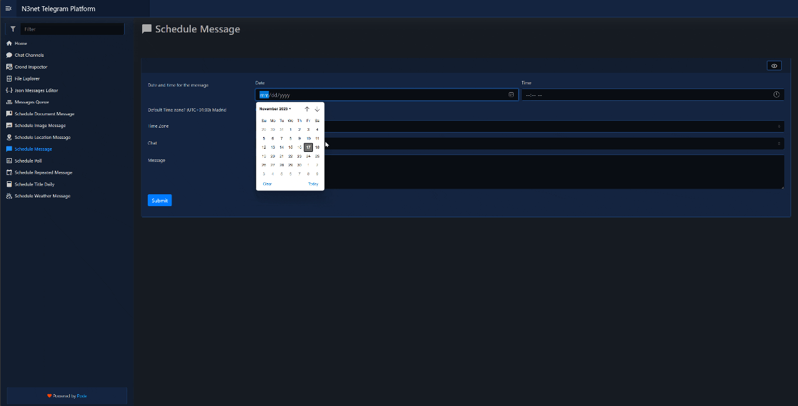
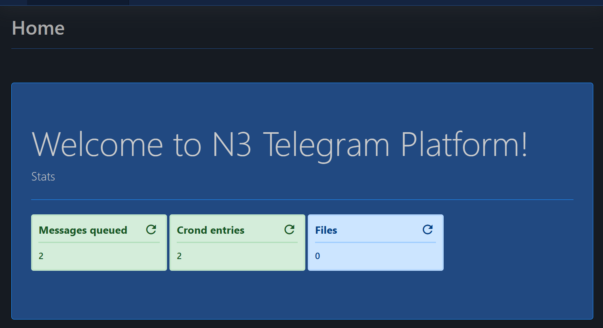

# Pwsh-Telegram-Scheduler

[](https://github.com/PowerShell/PowerShell) 


A frontend + logic for scheduling and sending messages with telegram. All in PowerShell 7.



## Why?

I used to plan trips with my family and friends, and I always liked to make all the information easily accessible for them, including locations, the day's plan, and more.

Since carrying everything on paper isn't always practical, I decided to send messages via Telegram at specific times. I considered using a Telegram bot and realized I needed to schedule and plan messages in advance. Creating a user-friendly interface was essential. As I'm not a web developer, I opted for a language I'm more familiar with: PowerShell.

This tool allows you to effortlessly create and schedule various types of messages to be sent at specific times (and time zones) to any chat that your Telegram bot has access to.

In this document, I'll walk you through the specifics of setting this up as easily as possible. Before concluding, I'd like to acknowledge the authors of the PowerShell modules used for creating this tool:


- techthoughts2
  - pwshPlaces: https://github.com/techthoughts2/pwshPlaces/
  - PoshGram: https://github.com/techthoughts2/PoshGram/ 
- Badgerati
  - Pode + Pode.Web: https://github.com/Badgerati/Pode.Web

Please consider to check their projects and sponsor them.

## Basics

I´m assuming that you have some basic knowledge with PowerShell and docker for this documentation.

### Multiplatform-ish

While the project is multiplatform , as all the modules used are using PowerShell 6+, most of the code was planned to run under docker with Linux. You can test on Windows and Mac, but the part of the scheduler (as is using crontab) won´t work and you will need to find another solution.

### Code quality

As I mentioned before, the website is build using Pode.Web, and it has some limitations. Among other things passing variables between pages it can be difficult if not using well written modules or global variables. This is a hobbyist project, I will try to improve the code and better document it with time. Feel free to ask any questions, fork and report errors.

## How it works + Configuration

Input the information on the website, messages will be saved in a json file and scheduled using crond. 

### Config files

- **[config\config.json](https://github.com/Naseito/Pwsh-Telegram-Scheduler/blob/main/config/config.json)**: 
  - Set the [Bing Maps API Key](https://learn.microsoft.com/en-us/bingmaps/getting-started/bing-maps-dev-center-help/getting-a-bing-maps-key)
  - Set the [Telegram bot API Key](https://core.telegram.org/bots/faq#how-do-i-create-a-bot). Please make sure the bot is admin of your group/chat, or some features may not work (such as title change).
- **[config\channels.json](https://github.com/Naseito/Pwsh-Telegram-Scheduler/blob/main/config/channels.json)**:
  - To add/remove chats/channels from the list. No need to edit it manually as thee website has a page to allow to add and delete them.
- **[messages\messages.json](https://github.com/Naseito/Pwsh-Telegram-Scheduler/blob/main/messages/messages.json)**: This is the json file where all messages and their propeties will be stored. No need to edit manually as messages are scheduled from the web interface.
---

### Interface

Using Pode.Web module. It has all the fancy text boxes, selects and buttons to add new messages, aside from a couple of tools to check the status of the system.

---
#### Home

**[server.ps1](https://github.com/Naseito/Pwsh-Telegram-Scheduler/blob/main/server.ps1)**

This is the script that starts the server. It also has the homepage definition.



It has three quick overview panels for the number of messages queued, crond entries and files uploaded. Depending on the number it may change color.

__Code that you need to change to adapt the tool to your liking:__
- **Line 11** - Change the hostname (and port) to match the one that will be used for accesing the website. In my deployment I use an nginx reverse proxy to access the site, feel free to use a reverse proxy for tighter control and security.
``` Powershell  
Add-PodeEndpoint -Address * -Hostname subdomain.domain.com -Port 8080 -Protocol Http # Change the domain accordingly.
```

- **Lines 16 and 18** - Replace XXXXXXXX with the name you want for your deployment
``` Powershell
Use-PodeWebTemplates -Title 'XXXXXXXX Telegram Platform' -Theme Dark
New-PodeWebHero -Title 'Welcome to XXXXXXXX Telegram Platform!' -Message "Stats" -Content
```

#### Configuration tools

- **Chat Channels:** Here you can add and delete telegram channels. **[chatchannels.ps1](https://github.com/Naseito/Pwsh-Telegram-Scheduler/blob/main/pages/chatchannels.ps1)**
  > Please keep always at least one channel, as the code doesn´t handle nulls on the json yet.

#### Schedule Messages

There is a different page for each type of message to schedule, but most of the code, logic and error checking is the same.

- **Schedule message:** For sending a plain text message. It supports links and emojis! ❤️ **[schedulemessage.ps1](https://github.com/Naseito/Pwsh-Telegram-Scheduler/blob/main/pages/schedulemessage.ps1)**
- **Schedule message with document attached:** For sending a document (pdf and docx by default) with plain text messages. **[schedulemsgdoc.ps1](https://github.com/Naseito/Pwsh-Telegram-Scheduler/blob/main/pages/schedulemsgdoc.ps1)**
  To change the accepted extensions, please modify line 50:
  ``` Powershell
    New-PodeWebFileUpload -Name "Document" -DisplayName "Select Document" -Accept ".pdf", ".docx"
  ```
- **Schedule message with image attached:** For sending an image with plain text messages. **[schedulemsgimage.ps1](https://github.com/Naseito/Pwsh-Telegram-Scheduler/blob/main/pages/schedulemsgimage.ps1)**
- **Schedule message with location/map:** This sends a location that will show up as a map + point on telegram. **[schedulemsgloc.ps1](https://github.com/Naseito/Pwsh-Telegram-Scheduler/blob/main/pages/schedulemsgloc.ps1)**
  
  I use Bing Maps API and you will need to create a free API KEY:
  https://learn.microsoft.com/en-us/bingmaps/getting-started/bing-maps-dev-center-help/getting-a-bing-maps-key
  
  When filling the location try to match as possible the name of the location in Bing Maps, regrettably it makes more mistakes than Google Maps (but hey, is free!)
  
- **Schedule message with a poll:** This sends a message with a poll. **[schedulemsgpoll.ps1](https://github.com/Naseito/Pwsh-Telegram-Scheduler/blob/main/pages/schedulemsgpoll.ps1)**

- **Schedule repetitive messages:** This allows the schedule a message to be repeated daily and weekly (you can select any day, from Monday to Tuesday) until a certain date. **[schedulemsgrep.ps1](https://github.com/Naseito/Pwsh-Telegram-Scheduler/blob/main/pages/schedulemsgrep.ps1)**

- **Schedule countdown title change:** The purpose of this is to do a countdown for the group title. Use %% in the message field for automatic replacement of the days left to the date.  **[scheduletitle.ps1](https://github.com/Naseito/Pwsh-Telegram-Scheduler/blob/main/pages/scheduletitle.ps1)**

__Common code in this pages that you need to change to adapt the tool to your liking:__
``` Powershell
$messagetimezone = $(if ($WebEvent.Data['DefaultTimeZone'] -eq $true) { $([System.TimeZoneInfo]::GetSystemTimeZones() | Where-Object -Property DisplayName -Like "*Madrid*" | Select-Object -ExpandProperty DisplayName) } else { $WebEvent.Data['TimeZone'] })
 ```
Change ``` [...] -Like "*Madrid*" [...] ``` to the name of your closest city or timezone. To get a list, run ```[System.TimeZoneInfo]::GetSystemTimeZones()``` in the same OS type than the one where the site will be running (Linux and Windows use different naming for timezones)

Same here:
``` Powershell
New-PodeWebCheckbox -Name 'DefaultTimeZone' -Checked -AsSwitch -DisplayName "Default Time zone? (UTC+01:00) Madrid"
```
Change the ``` [...] "Default Time zone? (UTC+01:00) Madrid" [...] ``` part to match your timezone (this only changes the label on the site).

---

#### Visualization tools

- **Crond Inspector:** In this page you can see a raw dump of crond and check if the messages are correctly scheduled. Read-only. **[crondinspector.ps1](https://github.com/Naseito/Pwsh-Telegram-Scheduler/blob/main/pages/crondinspector.ps1)**
- **Message queue:**  In this page you can see (and delete) all the scheduled messages in a table. **[messagesqueue.ps1](https://github.com/Naseito/Pwsh-Telegram-Scheduler/blob/main/pages/messagesqueue.ps1)**
- **JSON Editor:** In this page you can edit messages.json to do quick fixes. **[jsoneditor.ps1](https://github.com/Naseito/Pwsh-Telegram-Scheduler/blob/main/pages/jsoneditor.ps1)**
- **File Explorer:**  In this page you can check the documents and images uploaded. **[fileexplorer.ps1](https://github.com/Naseito/Pwsh-Telegram-Scheduler/blob/main/pages/fileexplorer.ps1)**
  
---

#### Scheduler and Send Telegram Messages

- The scheduler part **[scheduler.ps1](https://github.com/Naseito/Pwsh-Telegram-Scheduler/blob/main/scheduler.ps1)** and **[scheduler.psm1](https://github.com/Naseito/Pwsh-Telegram-Scheduler/blob/main/scheduler.psm1)** don´t need to be edited. Basically schedules the message by adding an entry to crond. This is run after adding or deleting a message of any tipe, edit the json file from the message and every time the container is started (this way you can safely destroy the container without losing the schedule of the messages)
- **[sendtgmessage.ps1](https://github.com/Naseito/Pwsh-Telegram-Scheduler/blob/main/sendtgmessage.ps1)** --> This is the script that takes care of sending the messages to the Telegram API. It is called from crond and receives the ID of the message as an argument.

### Deployment 

1. Copy all the files (after changing values as proposed in previous steps) to a folder on your linux host. That folder will be the one mounted in the "volumes" part of docker compose.

#### Docker Compose:

``` yaml
version: '3'
services:
  telegram:
    build: .
    container_name: telegram
    environment:
      - PUID=1003 #Change it accordingly
      - PGID=1003 #Change it accordingly
      - TZ=Europe/Madrid
    volumes:
      - /home/pode/n3tgweb:/usr/src/app
    command: pwsh -c /usr/src/app/scheduler.ps1 && crond -b && pwsh -c /usr/src/app/server.ps1
    networks:
      automationbridge:
        ipv4_address: xxx.xxx.xxx.xxx #Change it accordingly
    restart: always
networks:
  default:
    external:
      name: automationbridge
  automationbridge:
    external: true
```
1. Change PUID and PGID to match the user and group of the user that owns the folder with the files in linux.
2. Network: This docker compose file was done with an isolated network called "automationbridge" in mind. The network was created outside the docker compose file. In the same network there is an nginx container that reverse proxies to this container.
   1. If you want to use the default network, remove all "network" tags and below properties in the file.
   2. If you don´t want to reverse proxy, just export ports directly:
   ``` yaml
      ports:
      - 8080:8080
   ```
3. Change ``` TZ=Europe/Madrid ``` to your time zone

#### Dockerfile

Is used to install the missing dependencies/modules. No need to change it.